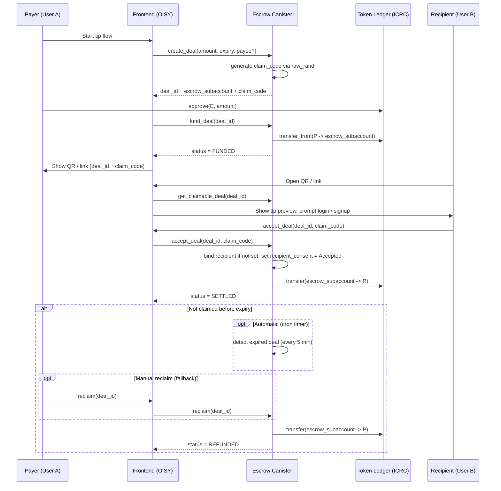

> **Looking for the visual flow?** [`docs/flows/tip.md`](docs/flows/tip.md) has a compact sequence + state diagram for tips. The full set of flows (tip / payer-creator / recipient-creator / dispute) lives under [`docs/flows/`](docs/flows/). This file keeps the long-form security model + frontend integration notes for the tip flow specifically.

## Tip flow (MVP)

The tip flow is a simple **YES/YES escrow flow**:

- the payer creates and funds a tip deal
- the recipient receives a QR code or link containing the `deal_id` and `claim_code`
- if the recipient signs up, provides the correct claim code, and accepts before expiry, the funds are released
- if the recipient never claims the tip, the funds are refunded after the deadline

### Claim code

Every deal gets a **cryptographically random 128-bit claim code** (generated via `raw_rand`). For open (unbound-recipient) deals, this code must be provided in `accept_deal` to authorize the fund release. The claim code is:

- Returned to the creator in the `DealView` after `create_deal`
- **Never** exposed via `get_claimable_deal` (the public preview endpoint)
- Encoded in the QR code / share link alongside the `deal_id`
- Not required when the recipient's principal is already bound to the deal

### Consent

For tips, consent is handled implicitly:

- **Payer consent** → automatically `Accepted` at creation (the payer initiated the tip)
- **Recipient consent** → automatically `Accepted` when the recipient claims (`accept_deal`)

For two-party deals where both parties are known upfront, both must explicitly consent via `consent_deal` before funding can proceed.

### Expiry & Refund Mechanism

Refunds after expiry are handled in two complementary ways:

- **Automatic refund (cron timer)**
  - the escrow canister runs a repeating timer (every 5 minutes) that scans for expired funded deals and refunds them automatically — no user interaction needed
  - the timer is started on canister install (`#[init]`) and restarted on every upgrade (`#[post_upgrade]`)
  - a re-entrancy guard ensures at most one sweep is in-flight at a time

- **Manual reclaim (fallback)**
  - the payer can always explicitly call `reclaim(deal_id)` after expiry
  - useful as a fallback if a specific deal was missed by the sweep batch limit

> [!WARNING]
> All funding, settlement, and refund operations **must be idempotent**.
> This prevents double execution in case of retries, race conditions, or partial failures.

---

# Sequence Diagram (idiomatic)

---

# Other flows

The two-party deal and dispute flows used to live here as standalone Mermaid diagrams. They've moved into the dedicated visual-flow docs so they stay in sync with the canister behaviour:

- [`docs/flows/payer-creator.md`](docs/flows/payer-creator.md) — payer creates a bound deal with a known recipient (former "Two-party deal flow").
- [`docs/flows/recipient-creator.md`](docs/flows/recipient-creator.md) — recipient creates an invoice for a known payer (atomic dispute reserve at create time).
- [`docs/flows/dispute.md`](docs/flows/dispute.md) — open / evidence / vote / finalize / out-of-band withdraw.

The **post-funding** behaviour for bound deals is no longer "recipient unilaterally calls `accept_deal` and the deal settles". It's now a two-party signature tally: each side calls `sign_yes` / `sign_no` and the outcome is decided by the combined result (both `Yes` → `Settled`, both `No` → `Aborted`, mixed → auto-`Disputed`). At expiry, any `Empty` signature defaults to `Yes` (silence = release). See the visual flows for the diagrams.
