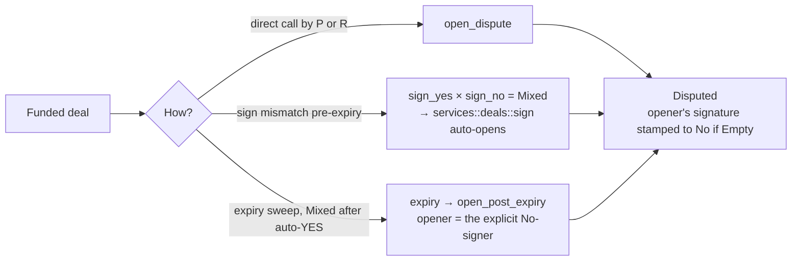
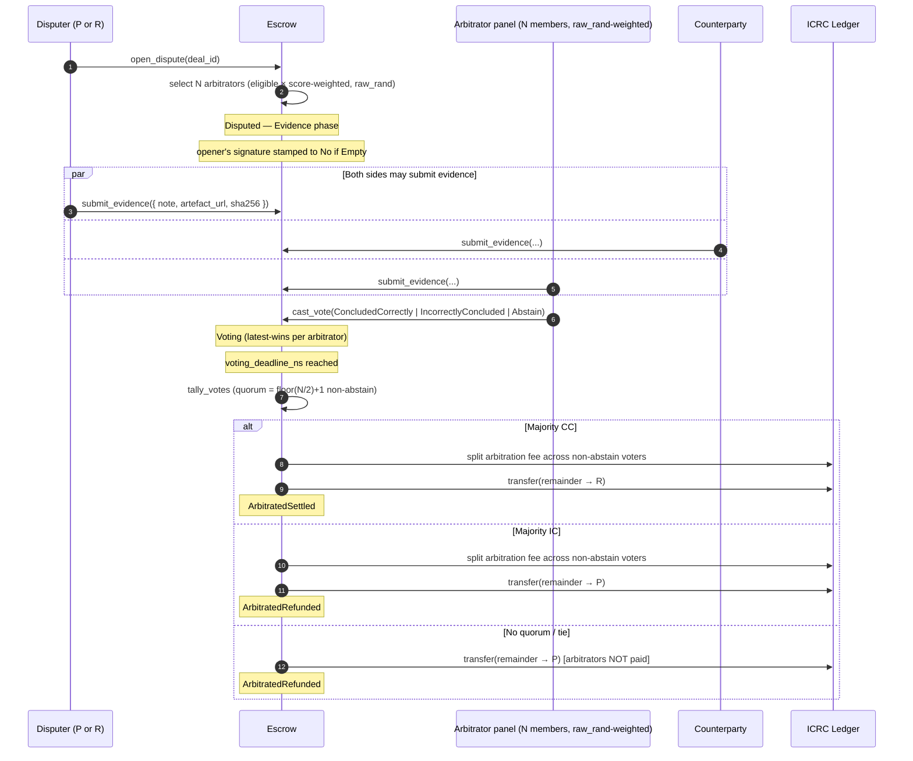
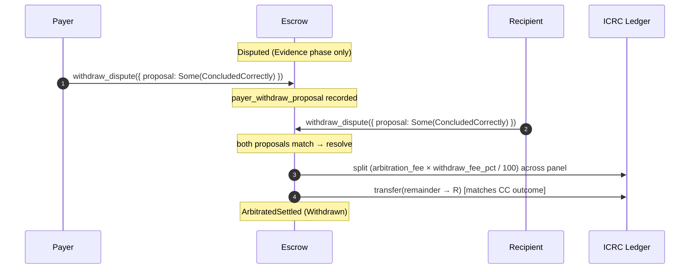
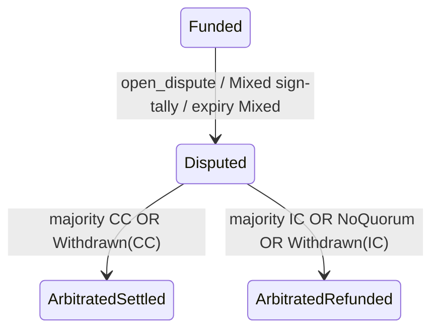

# Dispute flow

A dispute opens on a `Funded` bound deal — manually via `open_dispute`, automatically when a sign-tally produces a mixed outcome, or automatically when expiry's auto-YES rule produces a mixed tally on an expired deal. A randomly-weighted panel of curated arbitrators votes; majority decides the outcome. Either party can also resolve out-of-band via matched `withdraw_dispute` proposals.

## How a dispute opens

## Lifecycle (panel-resolved)

## Out-of-band withdrawal

Both parties can independently propose an outcome during the Evidence phase. When both proposals match, the dispute resolves immediately and the panel receives a reduced fee (`withdraw_fee_pct`, default 25%) for the work already done.

`withdraw_dispute({ proposal: None })` retracts a prior proposal. Mismatched proposals stay recorded silently — either side can amend until both align.

## Status path

## Endpoints

| Step                  | Endpoint                                                                              |
| --------------------- | ------------------------------------------------------------------------------------- | ------------------------------ |
| Open (manual)         | `open_dispute(deal_id)` — caller-as-`No` recorded                                     |
| Submit evidence       | `submit_evidence({ note?, artefact_url?, artefact_sha256? })` (party or panel member) |
| Vote (panel only)     | `cast_vote({ vote })` during the voting window; latest-wins                           |
| Force-finalize        | `finalize_dispute(dispute_id)` — anyone after `voting_deadline_ns`; sweep auto-runs   |
| Out-of-band agreement | `withdraw_dispute({ proposal: Some(vote)                                              | None })` — Evidence phase only |
| Public read           | `get_public_dispute(dispute_id)` — no party / panel principals, no evidence URLs      |

## Notes

- **Tip flows can't be disputed** — no bound counterparty. Returns `DisputeRequiresBoundRecipient`.
- **Per-deal panel size** can be locked at `create_deal` time via `panel_size: Some(n)`, bounded by `[DisputeConfig.min_panel_size, DisputeConfig.max_panel_size]`. The locked value survives subsequent `update_config` changes.
- **No-quorum ≠ tie**: both fall back to `ArbitratedRefunded` (status quo for the payer); arbitrators are NOT paid in either case.
- **Reliability scoring**: arbitrators in the majority on a CC/IC outcome get `+1 disputes_voted` and `+1 disputes_with_majority`. `NoQuorum` and `Withdrawn` outcomes only bump `disputes_assigned`.
- **Auto-finalize timer** runs every 5 minutes; per-dispute errors are swallowed so a single ledger blip doesn't block the whole sweep.
- **Design history**: see [RFC-001](../rfcs/0001-dispute-resolution.md) for the dispute-resolution design rationale.
