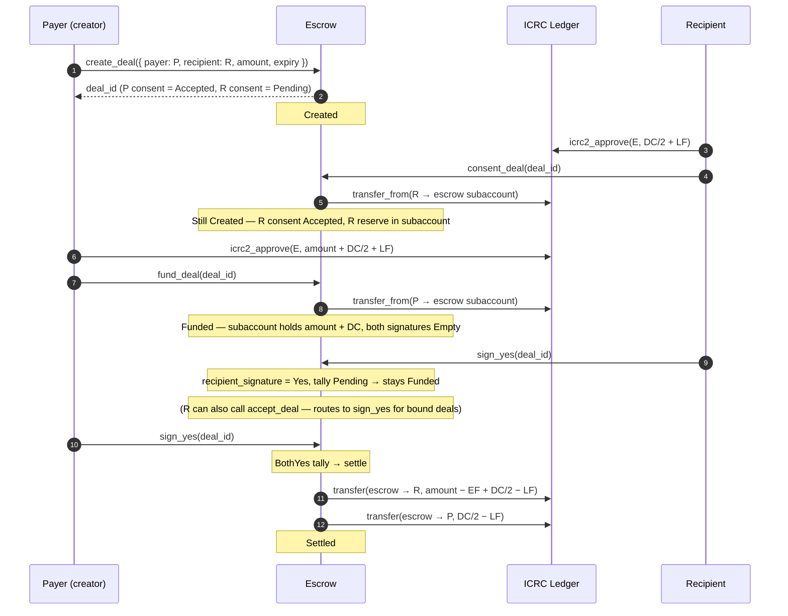
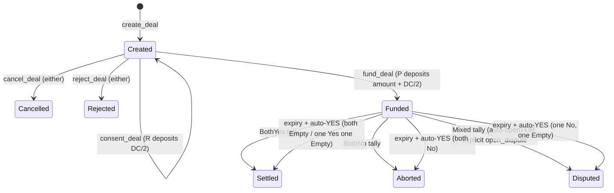

# Payer-creator deal (3a)

Payer creates a bound deal with a known recipient. Recipient consents (depositing their dispute reserve), payer funds, then both parties sign at settlement time.

## Sequence

## Status path

## Endpoints

| Step                          | Endpoint                                                         |
| ----------------------------- | ---------------------------------------------------------------- |
| Create                        | `create_deal({ recipient: Some(R), … })`                         |
| Recipient consent + reserve   | `consent_deal(deal_id)` (pulls `DC/2` via ICRC-2)                |
| Fund                          | `fund_deal(deal_id)` (pulls `amount + DC/2` via ICRC-2)          |
| Sign Yes                      | `sign_yes(deal_id)` (or `accept_deal` for the recipient)         |
| Sign No                       | `sign_no(deal_id)`                                               |
| Open dispute manually         | `open_dispute(deal_id)`                                          |
| Reclaim after expiry (P only) | `reclaim_deal(deal_id)` — routes through the same auto-YES tally |

## Tally outcomes

| `(payer_sig, recipient_sig)` | Status     | Money flow                                                 |
| ---------------------------- | ---------- | ---------------------------------------------------------- |
| `Yes` + `Yes`                | `Settled`  | R: `amount − EF + DC/2 − LF`; P: `DC/2 − LF`; sub keeps EF |
| `No` + `No`                  | `Aborted`  | P: `amount − EF + DC/2 − LF`; R: `DC/2 − LF`; sub keeps EF |
| `Yes` + `No` (or vice versa) | `Disputed` | Funds locked pending arbitration                           |
| `Empty` + anything           | `Funded`   | No movement; deal waits                                    |

`Aborted` and `Refunded` use **identical** fee math — the difference is the audit trail (mutual `No` vs expiry on a tip).

## At expiry

The 5-min housekeeping sweep (or a manual `reclaim_deal`) applies the auto-YES rule, then re-runs the tally:

| Before expiry           | After auto-YES | Outcome    |
| ----------------------- | -------------- | ---------- |
| both `Empty`            | `Yes` + `Yes`  | `Settled`  |
| one `Yes` + one `Empty` | `Yes` + `Yes`  | `Settled`  |
| one `No` + one `Empty`  | `No` + `Yes`   | `Disputed` |
| both `No`               | (unchanged)    | `Aborted`  |
