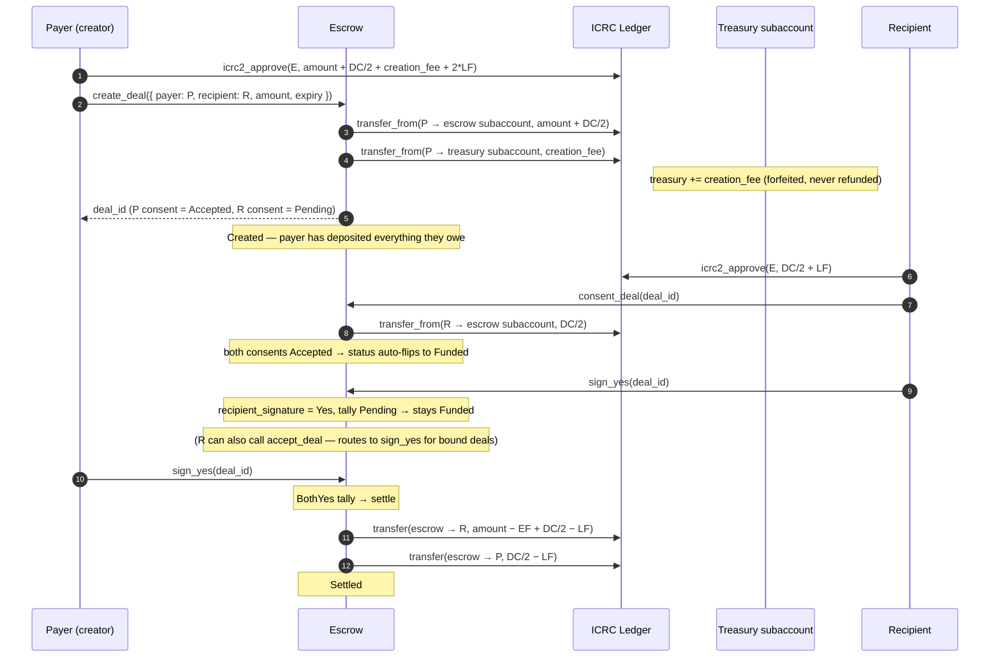
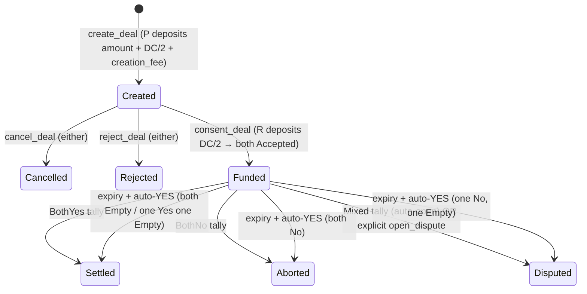

# Payer-creator deal (3a)

Payer creates a bound deal with a known recipient and **deposits everything they owe at create time** — `amount + DC/2` to the deal subaccount and `creation_fee` to the canister-owned treasury subaccount. Recipient consents (which deposits _their_ `DC/2` and auto-flips status to `Funded`). Both parties then sign at settlement time.

There is no separate `fund_deal` step.

## Sequence

## Status path

Note that `Funded` is now reached **at consent time** for bound deals (when the counterparty deposits and both consents are Accepted), not at a separate `fund_deal` step.

## Endpoints

| Step                          | Endpoint                                                                                   |
| ----------------------------- | ------------------------------------------------------------------------------------------ |
| Create + payer deposit        | `create_deal({ recipient: Some(R), … })` (pulls `amount + DC/2 + creation_fee` via ICRC-2) |
| Recipient consent + reserve   | `consent_deal(deal_id)` (pulls `DC/2` via ICRC-2; auto-flips to Funded)                    |
| Sign Yes                      | `sign_yes(deal_id)` (or `accept_deal` for the recipient)                                   |
| Sign No                       | `sign_no(deal_id)`                                                                         |
| Open dispute manually         | `open_dispute(deal_id)`                                                                    |
| Reclaim after expiry (P only) | `reclaim_deal(deal_id)` — routes through the same auto-YES tally                           |

## Tally outcomes

| `(payer_sig, recipient_sig)` | Status     | Money flow                                                 |
| ---------------------------- | ---------- | ---------------------------------------------------------- |
| `Yes` + `Yes`                | `Settled`  | R: `amount − EF + DC/2 − LF`; P: `DC/2 − LF`; sub keeps EF |
| `No` + `No`                  | `Aborted`  | P: `amount − EF + DC/2 − LF`; R: `DC/2 − LF`; sub keeps EF |
| `Yes` + `No` (or vice versa) | `Disputed` | Funds locked pending arbitration                           |
| `Empty` + anything           | `Funded`   | No movement; deal waits                                    |

`creation_fee` was deposited at create and lives in the treasury subaccount throughout the deal's lifetime — every terminal leaves it untouched.

`Aborted` and `Refunded` use **identical** fee math — the difference is the audit trail (mutual `No` vs expiry on a tip).

## Cancel / reject before consent

If the payer cancels (or the recipient rejects) BEFORE the recipient consents, the payer's create-time deposit (`amount + DC/2`) is refunded back to them minus one outgoing ledger fee. The `creation_fee` is already in the treasury and stays there (forfeited by design — it's the cost of having created a deal that consumed system resources).

## At expiry

The 5-min housekeeping sweep (or a manual `reclaim_deal`) applies the auto-YES rule, then re-runs the tally:

| Before expiry           | After auto-YES | Outcome    |
| ----------------------- | -------------- | ---------- |
| both `Empty`            | `Yes` + `Yes`  | `Settled`  |
| one `Yes` + one `Empty` | `Yes` + `Yes`  | `Settled`  |
| one `No` + one `Empty`  | `No` + `Yes`   | `Disputed` |
| both `No`               | (unchanged)    | `Aborted`  |
