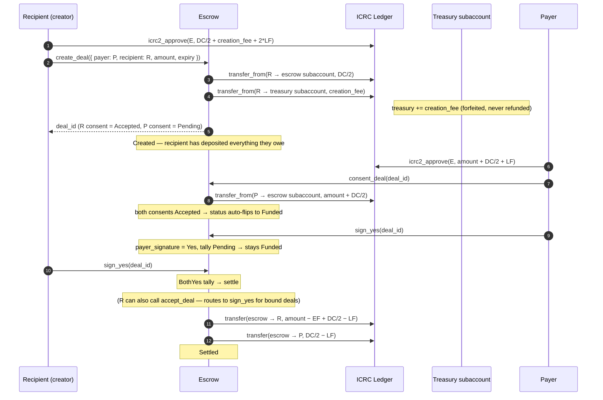
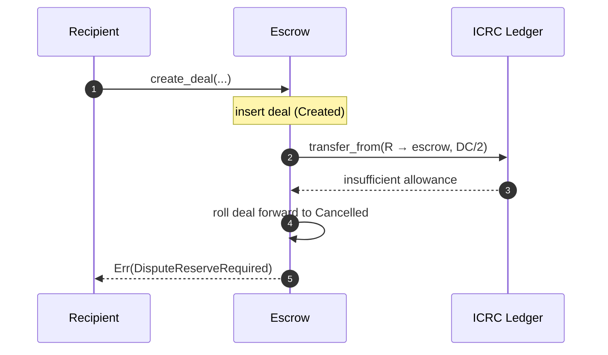

# Recipient-creator deal (3b — invoice)

Recipient creates the deal with the payer specified — their `DC/2` reserve and the `creation_fee` are pulled atomically inside `create_deal`. Payer's `consent_deal` then **deposits `amount + DC/2`** (the payer's first money-moving action) and auto-flips status to `Funded`. Both parties sign at settlement time.

There is no separate `fund_deal` step.

## Sequence

## Status path

Same as [payer-creator](./payer-creator.md#status-path) — the post-`Funded` state machine is shared. The only difference is the path _into_ `Created`:

- **3a** → payer creates and deposits `amount + DC/2` at create.
- **3b** → recipient creates and deposits `DC/2` at create; payer deposits `amount + DC/2` at consent.

Both flows reach `Funded` once both consents are `Accepted` (which only happens after the counterparty's money-moving consent).

## Endpoints

| Step                              | Endpoint                                                                               |
| --------------------------------- | -------------------------------------------------------------------------------------- |
| Approve + create (atomic deposit) | `create_deal({ payer: Some(P), recipient: Some(R), … })` (pulls `DC/2 + creation_fee`) |
| Payer consent + deposit           | `consent_deal(deal_id)` (pulls `amount + DC/2`; auto-flips to Funded)                  |
| Sign Yes                          | `sign_yes(deal_id)` (or `accept_deal` for the recipient)                               |
| Sign No                           | `sign_no(deal_id)`                                                                     |
| Open dispute manually             | `open_dispute(deal_id)`                                                                |
| Reclaim after expiry (P only)     | `reclaim_deal(deal_id)` — routes through the same auto-YES tally                       |

## Failure mode at create time

If the recipient hasn't approved the canister to pull `DC/2 + creation_fee` before calling `create_deal`, the call fails. The error variant depends on which transfer failed: `EscrowError::DisputeReserveRequired` if the big deposit failed first, `EscrowError::CreationFeeRequired` if the big deposit succeeded but the treasury transfer failed (in which case the big deposit is refunded back). Either way the half-formed deal is rolled forward to `Cancelled` automatically — **no stuck `Created` records**.

## Failure mode at consent time

If the payer hasn't approved enough to cover `amount + DC/2 + LF` before calling `consent_deal`, the transfer fails and the deal stays `Created` with `payer_consent = Pending` so the payer can fix the approval and retry.

## Tally outcomes + expiry behaviour

Identical to [payer-creator's tally + expiry tables](./payer-creator.md#tally-outcomes).
