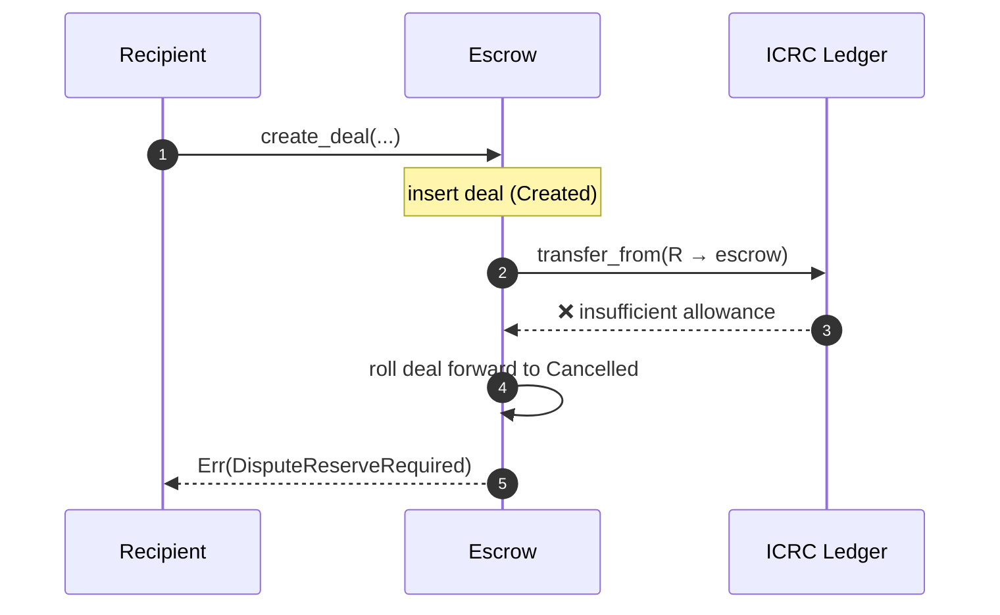

# Recipient-creator deal (3b — invoice)

Recipient creates the deal with the payer specified — their dispute reserve is pulled **atomically inside `create_deal`**. Payer consents and funds, then both parties sign at settlement time.

The post-funding flow is identical to [payer-creator](./payer-creator.md); only the pre-funding setup differs (the recipient's reserve lands at create time instead of consent time).

## Sequence

```mermaid
sequenceDiagram
    autonumber
    participant R as Recipient (creator)
    participant E as Escrow
    participant L as ICRC Ledger
    participant P as Payer

    %% --- Pre-approve + create (deposits DC/2 atomically) ---
    R->>L: icrc2_approve(E, worst_case_DC/2 + LF)
    R->>E: create_deal({ payer: P, recipient: R, amount, expiry })
    E->>L: transfer_from(R → escrow subaccount)
    E-->>R: deal_id (R consent = Accepted, P consent = Pending)
    Note over E: Created<br/>(R reserve already in subaccount)

    %% --- Payer consent (state flip only, no money) ---
    P->>E: consent_deal(deal_id)
    Note over E: Created (P consent = Accepted)

    %% --- Payer fund ---
    P->>L: icrc2_approve(E, amount + DC/2 + LF)
    P->>E: fund_deal(deal_id)
    E->>L: transfer_from(P → escrow subaccount)
    Note over E: Funded<br/>(subaccount holds amount + DC; both signatures Empty)

    %% --- Two-signature tally (happy path) ---
    P->>E: sign_yes(deal_id)
    Note over E: payer_signature = Yes; tally Pending → stays Funded
    R->>E: sign_yes(deal_id)
    Note over E: BothYes tally → settle<br/>(R can also use accept_deal — routes to sign_yes for bound deals)
    E->>L: transfer(escrow → R, amount − EF + DC/2 − LF)
    E->>L: transfer(escrow → P, DC/2 − LF)
    Note over E: Settled
```

## Status path

Same as [payer-creator](./payer-creator.md#status-path) — the post-`Funded` state machine is shared. The only difference is the path _into_ `Created`: recipient-creator does `create_deal` + atomic `transfer_from(R)` in one call; payer-creator does `create_deal` then `consent_deal` (which is when R's reserve moves).

## Endpoints

| Step                              | Endpoint                                                         |
| --------------------------------- | ---------------------------------------------------------------- |
| Approve + create (atomic deposit) | `create_deal({ payer: Some(P), recipient: Some(R), … })`         |
| Payer consent (state flip)        | `consent_deal(deal_id)`                                          |
| Fund                              | `fund_deal(deal_id)` (pulls `amount + DC/2` via ICRC-2)          |
| Sign Yes                          | `sign_yes(deal_id)` (or `accept_deal` for the recipient)         |
| Sign No                           | `sign_no(deal_id)`                                               |
| Open dispute manually             | `open_dispute(deal_id)`                                          |
| Reclaim after expiry (P only)     | `reclaim_deal(deal_id)` — routes through the same auto-YES tally |

## Failure mode at create time

If the recipient hasn't approved the canister to pull `DC/2` before calling `create_deal`, the call fails with `EscrowError::DisputeReserveRequired`. The half-formed deal is rolled forward to `Cancelled` automatically — **no stuck `Created` records**.



## Tally outcomes + expiry behaviour

Identical to [payer-creator's tally + expiry tables](./payer-creator.md#tally-outcomes).
