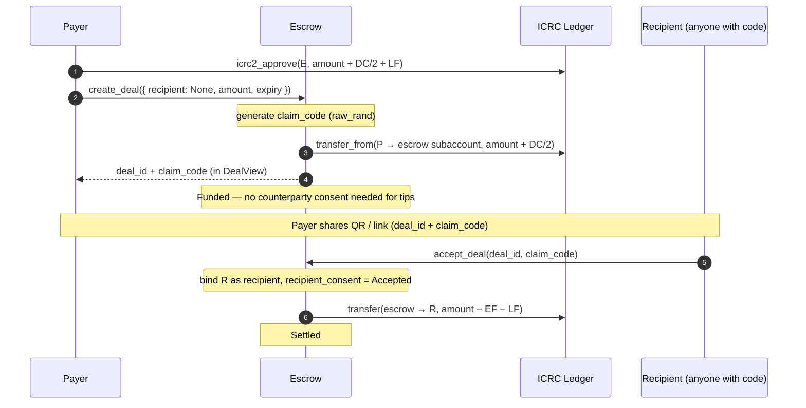
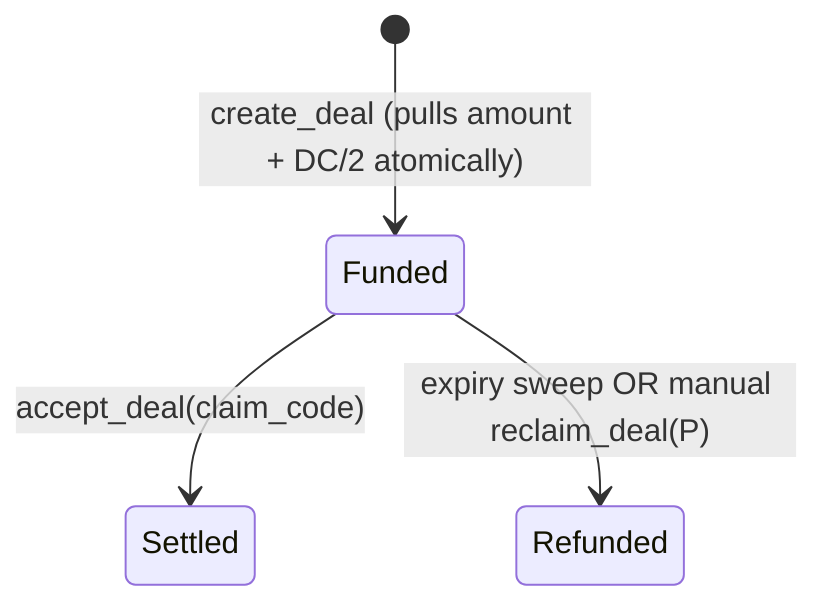

# Tip flow

Payer locks tokens for an unknown recipient. Anyone with the bearer claim code can claim before expiry; otherwise the funds refund to the payer.

The payer's deposit lands in the deal subaccount **at create time** (commit-at-first-action). There is no separate `fund_deal` step.

## Sequence

## Status path

Tips skip `Created` entirely — the payer's deposit is the only obligation, and it happens inside `create_deal`. Status goes straight to `Funded`.

## Endpoints

| Step                   | Endpoint                                                  |
| ---------------------- | --------------------------------------------------------- |
| Create + fund (atomic) | `create_deal({ recipient: None, … })`                     |
| Claim                  | `accept_deal(deal_id, claim_code)`                        |
| Refund (manual)        | `reclaim_deal(deal_id)` (payer only, after expiry)        |
| Refund (auto)          | `process_expired_deals(limit)` (or 5-min housekeeping)    |
| Public preview for QR  | `get_claimable_deal(deal_id)` (no auth, hides claim code) |

## Notes

- **No `creation_fee`.** Tips have no bound counterparty to spam, so no anti-spam deterrent applies.
- **No signature tally.** `sign_yes` / `sign_no` reject tip deals with `DisputeRequiresBoundRecipient`.
- **Disputes unavailable.** Same reason — no bound counterparty in canister state.
- **Expiry default = refund payer.** This is the _only_ flow where silence at expiry refunds the payer; for bound deals silence flips to release-to-recipient.
- **Long-form guide:** [`TIPS.md`](../../TIPS.md) covers the bearer-token security model, node-provider visibility caveats, and frontend integration.
